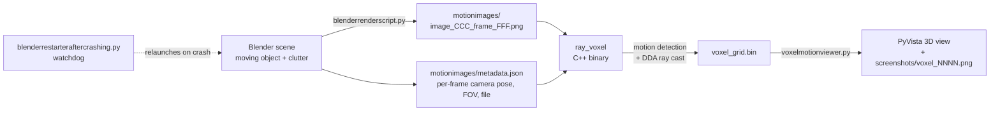
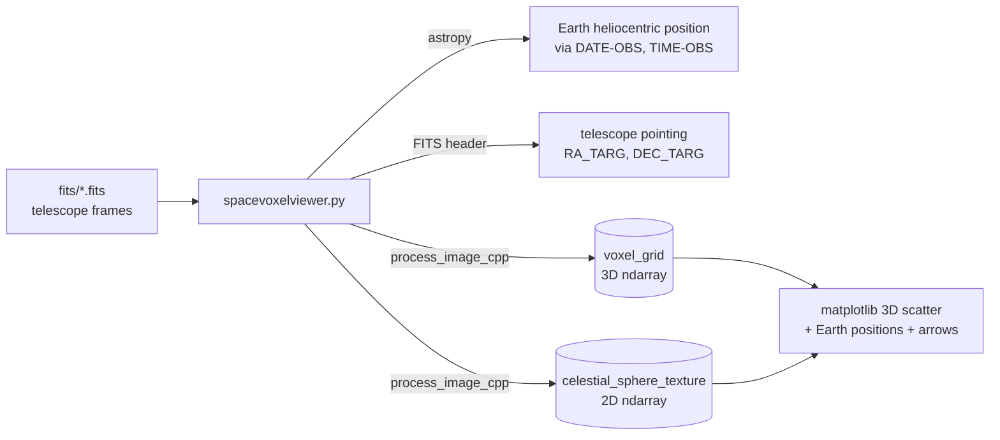

# Pixeltovoxelprojector

Project per-pixel motion (or per-pixel brightness) from one or more 2D images into a shared 3D **voxel grid** by casting rays through space. Bright voxels indicate where multiple rays *agree* — i.e. where moving / luminous things actually are in 3D.

The repository bundles two independent ray-casting pipelines plus a stand-alone super-resolution utility:

| Pipeline | Driver | Ray-caster | Use case |
|---|---|---|---|
| **Synthetic / Blender** | [`blenderrenderscript.py`](blenderrenderscript.py), [`blenderrestarteraftercrashing.py`](blenderrestarteraftercrashing.py) | [`ray_voxel.cpp`](ray_voxel.cpp) (standalone binary) | Many randomized cameras film a moving object; reconstruct its 3D track from inter-frame motion. |
| **Astronomical / FITS** | [`spacevoxelviewer.py`](spacevoxelviewer.py) | [`process_image.cpp`](process_image.cpp) (Python extension via pybind11) | Telescope FITS frames + ephemerides → 3D brightness reconstruction in a heliocentric voxel grid. |
| **PixelationDecensorer** | [`PixelationDecensorer.py`](PixelationDecensorer.py) | — (independent utility) | Recover a super-resolution view through a stationary pixelation grid that a window slides under. |

---

## 1. Concept

A pixel in a 2D image only constrains a 3D point to lie *somewhere along a ray* from the camera. With a single image the position is ambiguous. Given **many images from many viewpoints**, each "interesting" pixel contributes a ray, and the 3D location where many rays cross accumulates the most votes — that voxel becomes bright. This is essentially a sparse, brightness-weighted form of space carving / back-projection.

The two pipelines differ in *what counts as an "interesting pixel"*:

- **Blender / `ray_voxel.cpp`** — pixels whose intensity changed between consecutive frames of the same camera (motion).
- **FITS / `process_image.cpp`** — every pixel above zero brightness (with optional celestial-sphere background subtraction).

---

## 2. Repository layout

```
raycasting/
├── ray_voxel.cpp                       # Standalone C++ ray-caster (Blender pipeline)
├── process_image.cpp                   # pybind11 C++ extension (FITS pipeline)
├── setup.py                            # Builds process_image_cpp module
├── examplebuildvoxelgridfrommotion.bat # Example: compile + run ray_voxel
│
├── blenderrenderscript.py              # Blender: render N cameras × M frames + metadata.json
├── blenderrestarteraftercrashing.py    # Watchdog: relaunch Blender on crash, resume from JSON
│
├── spacevoxelviewer.py                 # FITS driver: ingest .fits → voxel grid → 3D plot
├── voxelmotionviewer.py                # Loader + PyVista viewer for voxel_grid.bin
│
├── PixelationDecensorer.py             # Independent super-resolution-through-pixelation tool
│
└── README.md
```

---

## 3. Pipeline A — Synthetic motion → voxel grid (Blender)

### 3.1 Data flow



### 3.2 Components

#### `blenderrenderscript.py`
Generates `N_CAMERAS` randomized poses (XYZ position, yaw/pitch/roll, FOV) that all see a chosen `TARGET_POINT`, then renders every (camera × frame) pair to PNG and writes `metadata.json` with a `"rendered": true/false` flag per entry. JSON is flushed atomically every `SAVE_EVERY` images so a crash loses at most a handful of frames.

Key globals (edit at the top of the file):

| Constant | Meaning |
|---|---|
| `OUTPUT_DIR` | Where PNGs and `metadata.json` are written. |
| `RES_X`, `RES_Y` | Render resolution. |
| `N_CAMERAS` | Number of randomized camera poses. |
| `TARGET_POINT` | World-space XYZ all cameras must see. |
| `POS_RANGE`, `ANG_RANGE`, `FOV_RANGE` | Uniform sampling ranges for pose. |
| `OBJ_NAME` | Main object whose motion is filmed. |
| `NEW_PHOTOS` | `True` to start fresh; `False` to resume from existing `metadata.json`. |

Run inside Blender:
```bash
blender -b your.blend --python blenderrenderscript.py
```

#### `blenderrestarteraftercrashing.py`
Watchdog that loops `blender --factory-startup -b ... --python <wrapper>` until every metadata entry has `rendered: true`. Useful for huge render jobs (`N_CAMERAS = 3000` × 8 frames). Update `BLENDER_EXE`, `BLEND_FILE`, `JOB_SCRIPT`, `OUTPUT_DIR` at the top.

#### `ray_voxel.cpp`
Standalone C++ executable with three responsibilities:

1. **Parse `metadata.json`** (uses `nlohmann/json.hpp`).
2. For each camera, sort frames by index and **detect motion** via absolute pixel-difference between consecutive grayscale frames (threshold `motion_threshold = 2.0f`).
3. For every changed pixel, build a world-space ray from camera pose + intrinsics and **walk the voxel grid with a 3D-DDA**, accumulating `pix_val` into every voxel the ray passes through.

Output: `voxel_grid.bin` — `int32 N`, `float32 voxel_size`, then `N*N*N` `float32` brightness values in row-major (X, Y, Z) order.

Hard-coded grid parameters live near the top of `main()`:
```cpp
const int   N           = 500;
const float voxel_size  = 6.f;
Vec3        grid_center = {0.f, 0.f, 500.f};
```

#### `examplebuildvoxelgridfrommotion.bat`
Convenience build + run:
```bat
g++ -std=c++17 -O2 ray_voxel.cpp -o ray_voxel
ray_voxel motionimages/metadata.json motionimages voxel_grid.bin
```
You will need [`nlohmann/json.hpp`](https://github.com/nlohmann/json) and [`stb_image.h`](https://github.com/nothings/stb) on your include path.

#### `voxelmotionviewer.py`
Loads `voxel_grid.bin`, extracts the top-percentile bright voxels, applies an optional Euler rotation to fix axis convention, and shows the cloud in a PyVista window. Saves a numbered screenshot to `screenshots/voxel_NNNN.png` so you can keep a history across runs.

---

## 4. Pipeline B — Astronomical FITS → voxel grid

### 4.1 Data flow



### 4.2 Components

#### `process_image.cpp` + `setup.py`
A pybind11 extension exposing a single function, `process_image_cpp(...)`. Build with:

```bash
pip install pybind11 numpy
python setup.py build_ext --inplace
```

The build enables OpenMP (`-fopenmp` / `/openmp`) and `-O3` so the per-pixel loop is parallel.

For each non-zero pixel in the input image the extension:

1. Computes a camera-space direction from `(j - cx, i - cy, focal_length)`.
2. Rotates it to world coordinates using a `(x_axis, y_axis, z_axis)` basis built from `pointing_direction` and a fall-back "up" vector.
3. Converts the world direction to RA/Dec, looks up (and optionally adds to) the **celestial-sphere texture**.
4. Optionally subtracts the celestial-sphere brightness as background.
5. Intersects the ray with the AABB of the voxel grid (`ray_aabb_intersection`), then steps along the ray in `num_steps` increments, adding `brightness` to every voxel the ray enters (`#pragma omp atomic`).

#### `spacevoxelviewer.py`
Driver script. The main configuration block is:

| Constant | Meaning |
|---|---|
| `voxel_grid_size` | `(nx, ny, nz)` voxel resolution. |
| `grid_extent` | Half-side length of voxel cube, in metres. |
| `distance_from_sun` | Distance from Sun to grid centre, in metres. |
| `center_ra`, `center_dec` | Direction from Sun to grid centre, in degrees. |
| `max_distance`, `num_steps` | Ray-casting depth + sampling. |
| `angular_width`, `angular_height` | Sky patch covered by the celestial-sphere texture, in degrees. |
| `texture_width`, `texture_height` | Texture resolution. |
| `fits_directory` | Folder of `.fits` files (sorted by `DATE-OBS` + `TIME-OBS`). |

Run after building the extension:
```bash
python spacevoxelviewer.py
```

It will print the brightest reconstructed RA/Dec/distance and pop up a 3D matplotlib scatter showing significant voxels, Earth positions per observation, and quivers of telescope pointing colour-coded by MJD.

---

## 5. PixelationDecensorer

[`PixelationDecensorer.py`](PixelationDecensorer.py) is unrelated to the voxel pipeline. It reconstructs a super-resolved view of content visible through a **stationary pixelation grid** while a window slides underneath it (each frame samples the underlying scene at a different sub-pixel phase).

Workflow:

1. Open a video, drag-pick the moving window (ENTER to accept).
2. Click one stationary grid intersection; nudge the cell size and phase with `W/S`, `,/.`, arrows, and `I/J/K/L` until the red overlay matches.
3. Script tracks the window across frames using an **edge-ring template** (`cv2.matchTemplate` on Sobel magnitude), samples each grid-cell centre, and splats the colour into a canonical canvas with either `nearest` or `bilinear` weights.
4. Optional iterative box-filter hole-fill (`FILL_MAX_ITERS`).

Outputs:
- `reconstruction_sr_before_fill.png`
- `reconstruction_sr.png`
- (Optional) `debug_gridtrack/overlays/grid_NNNNNN.png`, `tracking_log.csv`.

Best on **nearest-neighbour** mosaic censoring (sharp blocks); blur-kernel pixelation produces weaker results.

---

## 6. Quickstart

### 6.1 Synthetic pipeline (Blender → voxel)

```bash
# 1. Render frames inside Blender
blender -b yourscene.blend --python blenderrenderscript.py
#    (or run blenderrestarteraftercrashing.py to auto-resume on crash)

# 2. Build the voxel grid
g++ -std=c++17 -O2 ray_voxel.cpp -o ray_voxel
./ray_voxel motionimages/metadata.json motionimages voxel_grid.bin

# 3. Visualize
python voxelmotionviewer.py
```

### 6.2 FITS pipeline

```bash
# 1. Build the C++ extension
pip install pybind11 numpy astropy matplotlib pyvista
python setup.py build_ext --inplace

# 2. Drop FITS files into ./fits/
# 3. Run the driver
python spacevoxelviewer.py
```

### 6.3 PixelationDecensorer

```bash
pip install opencv-python numpy
# Edit VIDEO_PATH, CELL_SIZE, START_AT_FRAME at top of the file
python PixelationDecensorer.py
```

---

## 7. Dependencies

**Python (all pipelines combined):**
`numpy`, `astropy`, `matplotlib`, `pyvista`, `opencv-python`, `pybind11`, `bpy` (only when running inside Blender).

**C++ headers (vendored — drop into the project root or an include dir):**
- [`nlohmann/json.hpp`](https://github.com/nlohmann/json/releases) — single-header JSON parser used by `ray_voxel.cpp`.
- [`stb_image.h`](https://github.com/nothings/stb/blob/master/stb_image.h) — single-header image loader used by `ray_voxel.cpp`.

**Toolchains:**
- `g++` ≥ 7 (or MSVC) with C++17 and OpenMP for the extension build.
- Blender 3.x for the rendering pipeline.

---

## 8. Voxel grid binary format (`voxel_grid.bin`)

Written by `ray_voxel.cpp`, read by `voxelmotionviewer.py`:

| Offset | Type | Meaning |
|---|---|---|
| 0 | `int32` | `N` — grid is `N × N × N`. |
| 4 | `float32` | `voxel_size` — edge length of one voxel in world units. |
| 8 | `float32 × N³` | brightness, row-major: `index = ix*N*N + iy*N + iz`. |

`voxelmotionviewer.py` re-interprets this as `(z, y, x)` when extracting points, then applies an explicit Euler rotation (`rx=90°, ry=270°, rz=0°` by default) to align with PyVista's view conventions — change those values if your axis orientation looks wrong.

---

## 9. `metadata.json` schema (Blender pipeline)

Top-level value is a JSON array. Each element describes one (camera, frame) render and looks like:

```jsonc
{
  "camera_index":     0,
  "frame_index":      0,
  "camera_position":  [0.0, 0.0, 0.0],     // world XYZ, floats
  "yaw":              0.0,                  // degrees
  "pitch":            0.0,                  // degrees
  "roll":             0.0,                  // degrees
  "fov_degrees":      60.0,                 // horizontal FOV
  "object_name":      "obj",                // the object being filmed
  "object_location":  [0.0, 0.0, 0.0],     // world XYZ at this frame
  "image_file":       "image_000_frame_000.png",
  "rendered":         false                 // flipped to true on render success
}
```

`ray_voxel.cpp` only consumes `camera_index`, `frame_index`, `camera_position`, `yaw`, `pitch`, `roll`, `fov_degrees`, and `image_file`. The remaining fields are bookkeeping for the renderer / watchdog.

---

## 10. Known limitations / TODOs

- Distance attenuation in `ray_voxel.cpp` is currently disabled (`val = pix_val * 1.f`); the comment notes it should scale with apparent on-image size at distance.
- Several constants are hard-coded in `main()` of `ray_voxel.cpp` (`N`, `voxel_size`, `grid_center`, `motion_threshold`, `alpha`); make them CLI flags if you need to sweep configurations.
- `spacevoxelviewer.py` currently does a single pass with no real background-subtraction step; the `perform_background_subtraction` flag is wired through `process_image_cpp` but defaulted off in the driver.
- Both pipelines accumulate brightness into voxels but never normalize by the number of contributing rays — bright clusters can be inflated by camera coverage rather than scene structure.

---

## 11. License

See [LICENSE](LICENSE) (GPL-3.0).
